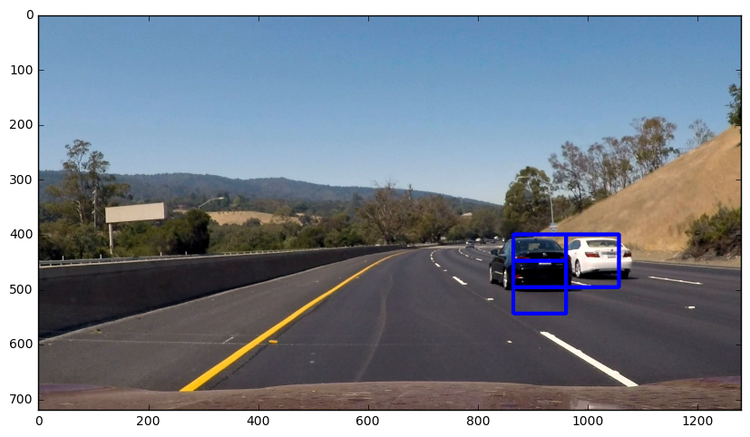
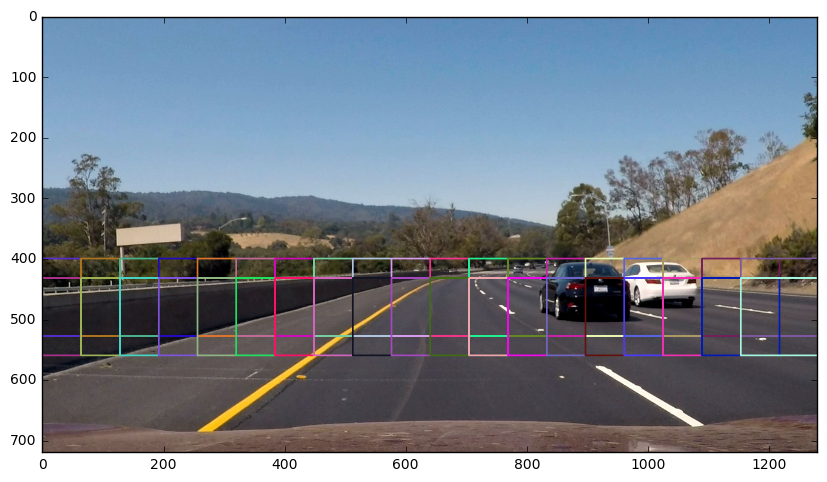
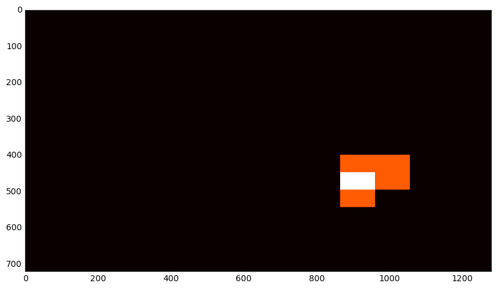
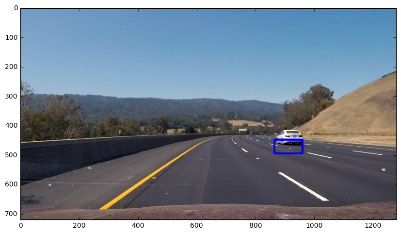
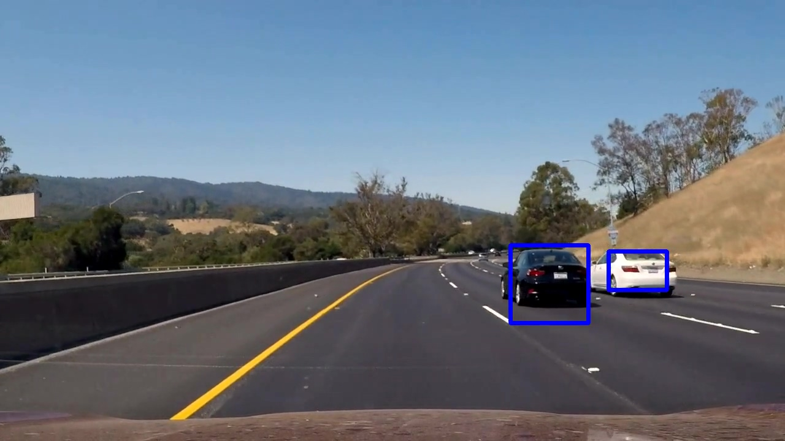
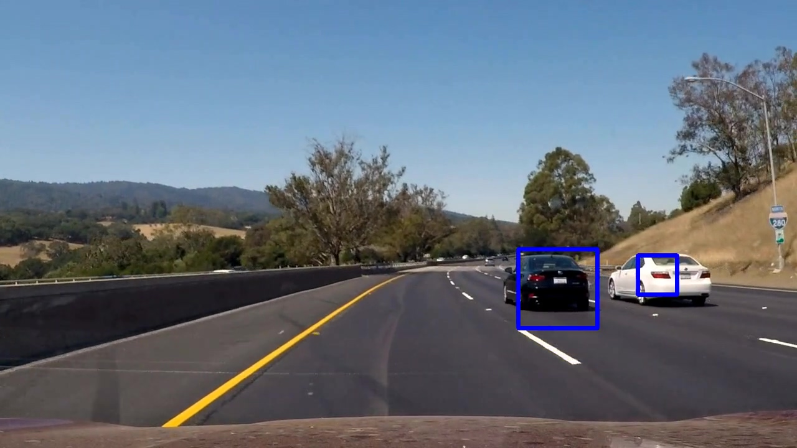
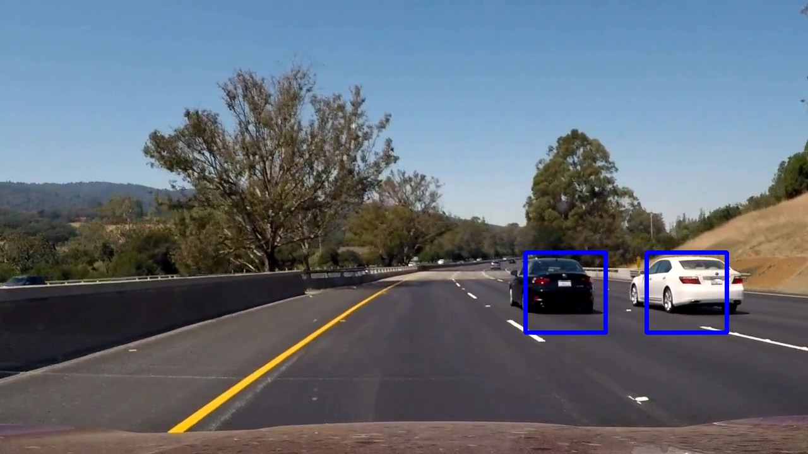
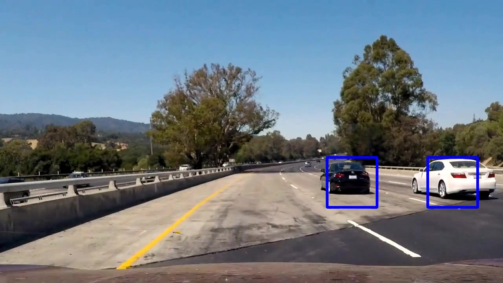

# Vehicle Detection and Tracking

The goal of this project to extract features HOG SVM learning using the vehicle to detect and track the position of the frame in the video stream and on the other hand, convolution neural network using the network to the same function.

The different approaches are shown below.

Support Vector Machine(SVM)   |  Convolution Neural Network
:----------------------------:|:------------------------------:
| 

The project is completed in the following stages:

- Phase 1: Extract HOG features from car and no car images. after build dataset to train a classifier.
- Phase 2: Train a SVM classifier to identify vehicles.
- Phase 3: Identify vehicles in video frame.
- Phase 4: Create Heatmap and tracking vehicles.

### Explore Color Space
(`.ipynb`: `Explore different approaches to feature generation`)
- Color histogram test, use histogram of pixel intensity features
cars[101] images above as an example 

This will be one of the characteristics of the image.

- RGB, HSV and YCrCb color space explorer using the same image.

RGB                        |  HSV                      |  YCC
:-------------------------:|:-------------------------:|:-------------------------:
       |       | 

Look at the distribution of the color values of each pixel in the color space.

### Extract HOG features
(`.ipynb`: `Classifiers, Project Solution - 1`)

The HOG feature is extracted by the get_hog_features method, and the figure below shows the histogram of the orientation gradient of the image, testing the parameters.

The HOG visualization is a representation of the dominant gradient direction with the brightness corresponding to the gradient intensity in each cell, rather than the feature vector. It is known that the YUV color space gives the best performance, so i decided to use it.

The determination of the HOG parameter should be based on experimental results and is selected through several tests. A small number of 300 data sets were sampled and generated and stored as pickle files.

The selected parameter is
Orient = 11, Pix_per_cell = 16, Cell_per_block = 2, Hog_channel = ALL

### Train a SVM classifier

I used LinearSVC from the sklearn library.
The data set provided by udacity for the project is the same number of car and nocar, so no separate sampling process is performed and the number of data finally used is as follows.

- Number of training examples = 14208
- Number of testing examples = 3552
- Number of valid train examples = 14208
- Number of valid test examples = 3552

### Sliding Window Search

HOG feature extraction and sliding window search method were used in combination. extract the feature from the whole image without individual extraction in each window, and sub-sample according to window size and supply to the classifier.

The image below is the result of `find_cars` method.

The scale has different false positives. So I tested various overlapping regions and combined them to have a duplicate true region. This is a good way to utilize the heatmap technique below.
Image below is a test to see the coordinates and scale in which the vehicle is detected in the rectangular area.
These tests will determine the size and scale of the various rectangles appropriately and make the heatmap technique work more robustly.

       |  
:----------------------------:|:------------------------------:
       |  

The combined detection area uses the heat map and the threshold, and the area enclosed by the overlapping rectangles is assigned a higher level of heat.

The final detection area labels the highest column in the heatmap and is set to the end.

Result image is shown below.

   |  
:----------------------------:|:------------------------------:
   |  

In the first attempt, i learned a lot of data by using SVM classifier and used only Y channel in YUV space. i guess that there was an overfitting problem, but i was advised to use all the color spaces in the forum, and it gave better results. When i learned again with a relatively small number of data, it showed 98.2% accuracy and also been significantly reduced processing time.

### Tracking image frame in a video
Code that processes video frames is implemented in an `Process Video Frame` cell and stores the previous 13 frames by creating a detection history. Detects by setting a heat map threshold greater than +1 at half of the saved frame based on the previous saved frame. It is more effective to perform it empirically using the previous frame rather than searching in one frame.

### Discussion
In addition, i have created and tested a classifier using deep learning. i used a much larger number of data (car: 38780, nocar: 38780) than when using svm. process of extracting the HOG feature and tuning the parameters is excluded, and the process of creating the heat map can be simple. the implementation of the application has been simplified by extracting the valid features in the hidden layer convolution process.
However, the issue of the deep learning approach requires a large amount of learning data, but if sufficient learning data can be provided, a more practical solution than the traditional computer vision approach would be possible.

Currently implemented code has scale problems, but there are excellent deep-running structures such as 

- [Single Shot MultiBox Detector (SSD)](https://arxiv.org/abs/1512.02325)
- [Real-Time Object Detection (YOLO)](https://pjreddie.com/media/files/papers/yolo.pdf)
- [SqueezeDet](https://arxiv.org/abs/1612.01051)

There is still a possibility that an object that is far away can not be identified.
